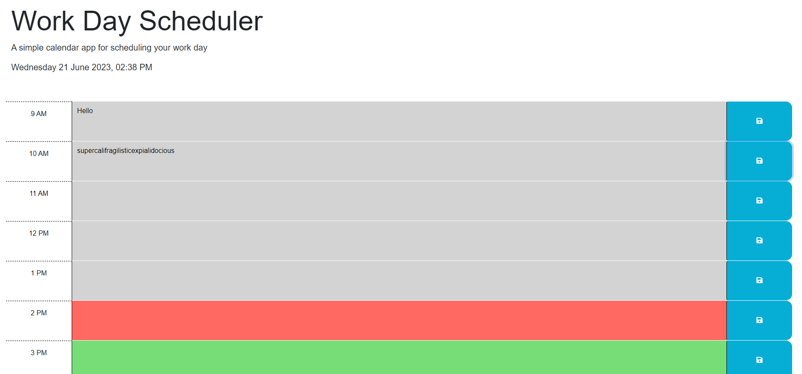

# Work-Day-Scheduler

## Description

This refactored code for a simple calendar application that allows a user to save events for each hour of a typical working day (9am - 5pm). This app will run in the browser and feature dynamically updated HTML and CSS powered by jQuery.

## Credits

Author: Xandromus from the Rice Coding Bootcamp

Jul 12, 2022

Source code: HTML,  CSS, and JavaScript

https://github.com/coding-boot-camp/crispy-octo-meme

## Features

At the top it will show the exact date, time, and time zone. The hour blocks are colored depending if they are in the past, present, or future. They will be updated automatically if the hour changes. The user can type out anything in the time blocks and can save it with the button to it's right. The saved information will be saved and show upon refresh and opening after the browser will close. At the bottom the user can press the Clear Day button which will remove all saved data and clear all the time blocks.

## Link/Screentshot

https://cymcolor.github.io/Work-Day-Scheduler/

